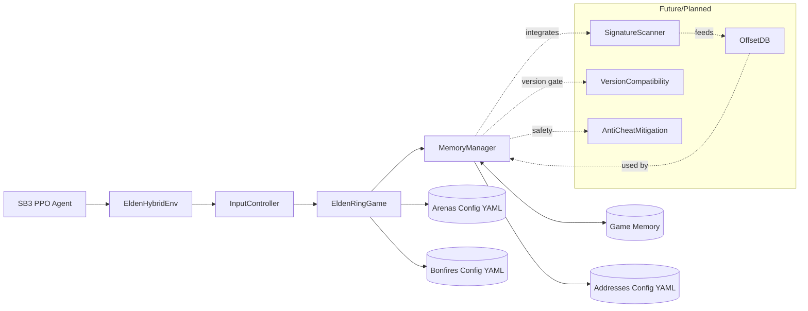

# EldenRL (Hybrid) – Single pipeline using vision + memory

EldenRL uses one unified environment that combines a real game image (for spatial context) with precise state read from game memory (hp, stamina, boss hp, etc.). Rewards and termination come from memory; the image is for perception of obstacles and motion.

## Requirements
- Windows 10/11
- elden ring offline, developed in v1.16 (DLC inc)
- Python 3.9+
- Stable-Baselines3, PyTorch (--index-url https://download.pytorch.org/whl/cu126  {ur cuda ver at 126 using nvcc -V })
- OpenCV, `mss`
  
Note: This project is standalone. Other projects like “SoulsGym” are reference-only (useful for ideas).

## Quick start

1. Install dependencies (venv recommended) with requirements-pip.txt
2. Configure `main.py` (Hybrid is default)
3. Run `python main.py`

## Configuration

`main.py` exposes the runtime config. Key fields:

- `PROCESS_NAME`: Game executable name (default: `eldenring.exe`).
- `GAME_MODE`: "PVE" for boss fights, other values for PvP/general exploration (default: "PVE").
- `BOSS`: ID of the boss arena to train in (from `config/arenas.yaml`).
- `DESIRED_FPS`: Target frames per second for the environment step loop.
- `LOG_MEMORY_DEBUG`: Enable verbose memory reading logs.
- `MEMORY_DEBUG_INTERVAL`: Interval in steps for memory debug logs.
- `MONITOR`: Monitor index for screen capture (e.g., 1 for primary monitor).
- `DEBUG_MODE`: Enable debug overlay on the captured image.
- `NUMBER_DISCRETE_ACTIONS`: Total number of discrete actions for the agent.
- `DISABLE_INPUT`: Set to `True` to disable keyboard input from the `InputController` (useful for debugging).
- `TIME_ALIVE_PENALTY_PER_SECOND`: Negative reward applied per second alive (default: 1.0).
- `NO_BOSS_HIT_PENALTY_PER_SECOND`: Negative reward applied per second without hitting the boss (default: 5.0).
- `PROGRESS_REWARD_SCALE`: Scale for the reward based on boss HP lost (default: 150.0).

The `config/app.yaml` (or `app.sample.yaml`) file provides a central place for these settings.
Memory addresses, AOB patterns, arena spawn points, and bonfire IDs are managed in:
- `config/addresses.yaml`
- `config/arenas.yaml`
- `config/bonfires.yaml`

## Architecture

## Memory Address Architecture

To ensure stability across game restarts, this project does **not** use hardcoded memory addresses. Instead, it uses a multi-level pointer system common in game hacking, originating from tools like Cheat Engine. The process is defined in `config/addresses.yaml` and works as follows:

1.  **Find the Game's Base Address:** The program first finds the memory address where `eldenring.exe` is loaded. This address changes every time the game starts (due to ASLR).

2.  **Locate the Static Pointer:** The `bases_static` section of the config contains a list of **Relative Virtual Addresses (RVAs)**. An RVA is a fixed offset from the game's base address.
    *   The program calculates: `Static Pointer Address = Game Base Address + RVA`
    *   This address points to a **global pointer**, which acts as a stable "signpost" to a dynamic game structure.

3.  **Dereference to Find the True Base Address:** The program then reads the 8-byte value *at* the `Static Pointer Address`. This value is the **true, dynamic base address** of a core game structure (e.g., `WorldChrMan`). This address is dynamic and can change.

4.  **Follow the Offset Chain:** The `addresses` section of the config defines chains of offsets for specific values (like `PlayerHP`). Starting from the **true base address** found in Step 3, the program follows this chain:
    *   It reads the pointer at `(address + offset1)`.
    *   Then it reads the pointer at `(new_address + offset2)`.
    *   ...and so on, until the final offset is added to find the memory location of the desired value (e.g., the integer for the player's current health).

This multi-step process allows the program to reliably find game data even though the memory layout changes on each launch.

## Observation and rewards
- Observation (default):
  - `img`: `(MODEL_HEIGHT, MODEL_WIDTH, 3)` uint8
  - `prev_actions`: `(10, NUMBER_DISCRETE_ACTIONS, 1)` uint8
  - `state`: `(7,)` float32 = `[player_hp, player_stamina, boss_hp, time_alive_s, arena_phase, dist_to_boss, time_since_boss_dmg]`

- Reward/termination: computed purely from memory values, logic now integrated directly into `EldenHybridEnv`.

## Requirements for real memory backend

- Elden Ring process must be running and accessible.
- Game must be in single-player offline mode.
- Memory addresses and AOB patterns in `config/addresses.yaml` must match your game version (v16 when made)
- Using a new game save is recommended for safety

## Contributing
- You can contribute by extending the YAML configuration files with new addresses or arena data.
- Develop new `MemoryManager` methods for raw memory operations or `EldenRingGame` properties/methods for high-level game interactions.

## Credits

This project builds on the original EldenRL work

