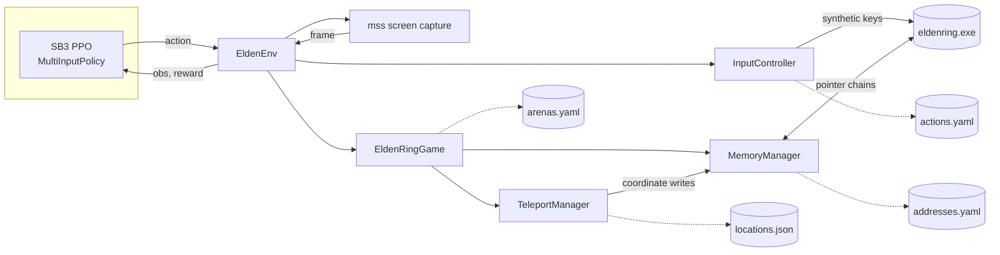

## EldenRL

A reinforcement learning environment for Elden Ring boss fights

The agent sees a downscaled capture of the game window,
but most rewards and some mixed-observations come from the internal memory. HP, boss HP, world coordinates and cutscene state are
resolved through pointers

This is an extensions/rewrite of [ocram444/EldenRL](https://github.com/ocram444/EldenRL),
which reads the same values with OCR and template matching against the HUD


**Observation**:

| Key | Shape | Contents |
| --- | --- | --- |
| vision | (90, 160, 3) uint8 | RGB screen capture |
| data | (2,) float32 | normalised player HP, normalised boss HP |

**Rewards**:

| Component | When |
| --- | --- |
| boss_damage | +150 x fraction of boss HP removed this step |
| hp_penalty | -100 x fraction of player HP lost this step |
| distance | shaped by TRAINING_MODE, zero in standard |
| time_alive | +0.1 per second survived, paid out on termination |
| win_bonus / lose_penalty | +200 on a kill, -100 on a death |

on a  episode reset, we wait for the death or cutscene transition to clear (sped up ingame time),
teleport to the arena coordinates, scan `WorldChrMan`'s character list for the
boss's `char_param_id`, lock on, then start agent

### memory access

Addresses are in `config/addresses.yaml` as ptr chains.
I manually extracted from the respective CE tables, and re-resolved for 1.16 version of the game,
since some bases were outdated


`MemoryManager.resolve()` flattens a chain recursively to its static base, walks
it, and caches the result. Teleporting reads the player's local coordinates and
the world's global coordinates, applies the offset between them, disables
gravity, writes, and re-enables gravity once the position settles.

pointer chains traced from two CE tables; the scripts they came
from are in [`tools/ct_scripts/`](tools/ct_scripts/)

### setup

- Elden Ring 1.16 with the Erdtree DLC
- windows, python 3.9+
- a NVIDIA GPU

```bash
pip install -r requirements.txt
pip install torch --index-url https://download.pytorch.org/whl/cu126  # match your cuda
```

Verify the pointer chains resolve against your build, every line should read ok:

```bash
python tools/memory_check.py
```

```bash
python main.py                      # train on the arena set from config/app.yaml
tensorboard --logdir logs/      #watch rewards
```


### Config

`config/app.yaml`:

| Const | Value |
| --- | --- |
| `DISABLE_INPUT` | Log actions instead of sending keys |
| `BOSS` | the boss arena id from `config/arenas.yaml` |
| `TIMESTEPS_PER_ITERATION` | Steps between checkpoints |
| `TRAINING_MODE` | `standard`, `aggressive`, `defensive` for distance shaping |

Other files: `actions.yaml` (action id to key), `arenas.yaml` (spawn point and
boss id per arena), `addresses.yaml` (pointer chains), `bonfires.yaml` (grace
ids), `locations.json` (saved teleport targets).

## teleporting cli

Capturing a new arena spawn point is easier than typing the coordinates, so just go stand where
you want the agent to start (for example this beastman bonfire) and:

```bash
python tools/tp_cli.py save beastman
python tools/tp_cli.py list
python tools/tp_cli.py go beastman
python tools/tp_cli.py delete beastman
```

Then copy the saved coordinates into a new `arenas.yaml` entry


### structure




### Credits

- [ocram444/EldenRL](https://github.com/ocram444/EldenRL): original rl in eldenring project
- [SoulsGym](https://github.com/amacati/SoulsGym): prior for memory-driven
  souls game environments, studied while building this
- The Hexinton all-in-one and ER TGA CE tables: source of the pointer
  chains and warp logic that I ported to python
