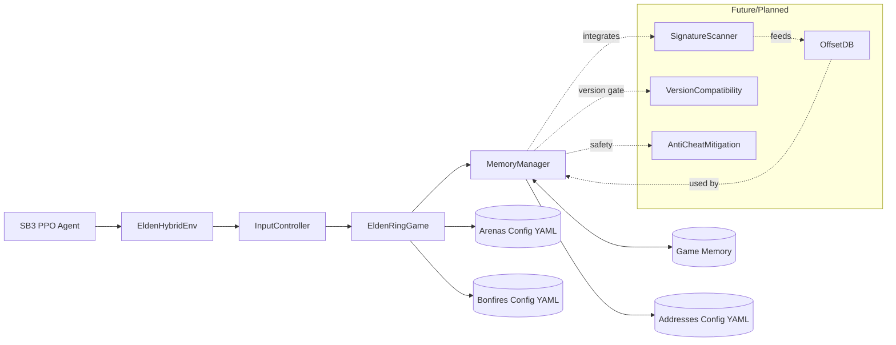

uses one unified environment that combines a real game image (for spatial context) with precise state read from game memory (hp, stamina, boss hp, etc.). Rewards and termination come from memory; the image is for perception of obstacles and motion.

## Requirements
-elden ring v16 (shadow dlc)
- windows
- elden ring offline, developed in v1.16 (DLC inc)
- Python 3.9+
- Stable-Baselines3, PyTorch (--index-url https://download.pytorch.org/whl/cu126  {ur cuda ver at 126 using nvcc -V })
- OpenCV, `mss`
  
note: project is standalone. used “SoulsGym” are reference-only (useful for ideas)

`main.py` exposes the runtime config. 
The `config/app.yaml` has settings:

- `GAME_MODE`: "PVE" for boss fights, other values for PvP/general exploration (default: "PVE").
- `BOSS`: ID of the boss arena to train in (from `config/arenas.yaml`).
- `DESIRED_FPS`: Target frames per second for the environment step loop.
- `LOG_MEMORY_DEBUG`: Enable verbose memory reading logs.
- `MEMORY_DEBUG_INTERVAL`: Interval in steps for memory debug logs.
- `MONITOR`: Monitor index for screen capture (e.g., 1 for primary monitor).
- `DEBUG_MODE`: Enable debug overlay on the captured image.
- `NUMBER_DISCRETE_ACTIONS`: Total number of discrete actions for the agent.
- `DISABLE_INPUT`: Set to `True` to disable keyboard input from the `InputController` (useful for debugging).
- `TIME_ALIVE_PENALTY_PER_SECOND`: Negative reward applied per second alive (default: 1.0).
- `NO_BOSS_HIT_PENALTY_PER_SECOND`: Negative reward applied per second without hitting the boss (default: 5.0).
- `PROGRESS_REWARD_SCALE`: Scale for the reward based on boss HP lost (default: 150.0).

Memory addresses, AOB patterns, arena spawn points, and bonfire IDs are managed in:
- `config/addresses.yaml`
- `config/arenas.yaml`
- `config/bonfires.yaml`

## Observation and rewards
- Observation (default):
  - `img`: `(MODEL_HEIGHT, MODEL_WIDTH, 3)` uint8
  - `prev_actions`: `(10, NUMBER_DISCRETE_ACTIONS, 1)` uint8
  - `state`: `(7,)` float32 = `[player_hp, player_stamina, boss_hp, time_alive_s, arena_phase, dist_to_boss, time_since_boss_dmg]`

TPData teleport tools

exact memory-flow Hexinton CE table used:

Read the games global coordinate floats (the same values CE’s “copypaste current coords” reads from NetManImp).

Pack those floats (plus the bonfire ID word) into a 32-byte TPData blob (exact CE layout).

Write that TPData blob into the game process (VirtualAllocEx + WriteProcessMemory) — exactly like CE’s alloc(TPData,32,"eldenring.exe") + readmem(...)->TPData.

Invoke the teleport logic by reading floats back from TPData and performing the same math CE’s InvokeTP does, then writing the resulting player-local floats into the player pointers (with gravity toggled while it writes).

## Credits

This project builds on EldenRL work, and of course uses the Hexinton CE table 

