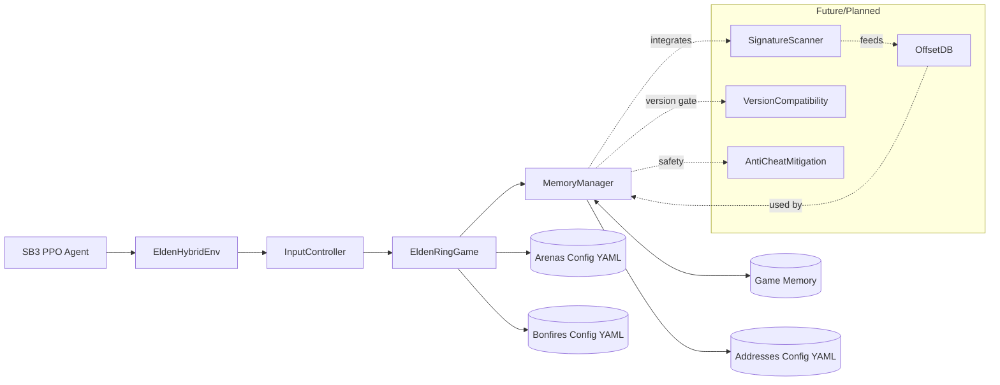

# EldenRL (Hybrid) – Single pipeline using vision + memory

EldenRL now uses one unified environment that combines a real game image (for spatial context) with precise state read from game memory (hp, stamina, boss hp, etc.). Rewards and termination come from memory; the image is for perception of obstacles and motion.

The training stack remains based on OpenAI `gym` (Gymnasium) and Stable-Baselines3.

## Requirements

- Windows 10/11
- Elden Ring running in single-player offline mode (fixed version while using memory addresses)
- Windows 10/11
- Elden Ring running in single-player offline mode (fixed version while using memory addresses)
- Python 3.9+
- Stable-Baselines3, PyTorch
- OpenCV, `mss`
  
Note: This project is standalone. Other projects like “SoulsGym” are reference-only (useful for ideas).

## Quick start

1. Install dependencies (venv recommended)
2. Configure `main.py` (Hybrid is default)
3. Run `python main.py`

## Configuration

`main.py` exposes the runtime config. Key fields:

- `PROCESS_NAME`: Game executable name (default: `eldenring.exe`).
- `GAME_MODE`: "PVE" for boss fights, other values for PvP/general exploration (default: "PVE").
- `BOSS`: ID of the boss arena to train in (from `config/arenas.yaml`).
- `DESIRED_FPS`: Target frames per second for the environment step loop.
- `LOG_MEMORY_DEBUG`: Enable verbose memory reading logs.
- `MEMORY_DEBUG_INTERVAL`: Interval in steps for memory debug logs.
- `MONITOR`: Monitor index for screen capture (e.g., 1 for primary monitor).
- `DEBUG_MODE`: Enable debug overlay on the captured image.
- `NUMBER_DISCRETE_ACTIONS`: Total number of discrete actions for the agent.
- `DISABLE_INPUT`: Set to `True` to disable keyboard input from the `InputController` (useful for debugging).
- `TIME_ALIVE_PENALTY_PER_SECOND`: Negative reward applied per second alive (default: 1.0).
- `NO_BOSS_HIT_PENALTY_PER_SECOND`: Negative reward applied per second without hitting the boss (default: 5.0).
- `PROGRESS_REWARD_SCALE`: Scale for the reward based on boss HP lost (default: 150.0).

The `config/app.yaml` (or `app.sample.yaml`) file provides a central place for these settings.
Memory addresses, AOB patterns, arena spawn points, and bonfire IDs are managed in:
- `config/addresses.yaml`
- `config/arenas.yaml`
- `config/bonfires.yaml`

## Architecture

## Observation and rewards

- Observation (default):

  - `img`: `(MODEL_HEIGHT, MODEL_WIDTH, 3)` uint8
  - `prev_actions`: `(10, NUMBER_DISCRETE_ACTIONS, 1)` uint8
  - `state`: `(7,)` float32 = `[player_hp, player_stamina, boss_hp, time_alive_s, arena_phase, dist_to_boss, time_since_boss_dmg]`

- Reward/termination: computed purely from memory values, logic now integrated directly into `EldenHybridEnv`.

## Requirements for real memory backend

- Elden Ring process must be running and accessible.
- Game must be in single-player offline mode.
- Memory addresses and AOB patterns in `config/addresses.yaml` must match your game version.
- Using a new game save is recommended for stability/safety.

## Notes on safety and scope

- This project is for educational research purposes only, designed for single-player offline use.
- Memory addresses are highly version-specific; ensure your game version remains fixed while you reverse and configure addresses.
- Start with one arena and iterate to ensure stability.

## Extending state and future work

- The `EldenRingGame` class provides a clean interface for adding more game-specific state and actions.
- You can extend `config/addresses.yaml` to include more memory features (e.g., FP/MP, specific debuffs, inventory items, detailed player/boss animation IDs).
- Further enhancements could include more sophisticated anti-cheat mitigation, automated signature scanning for version compatibility, and a more robust offset database.

## Contributing

- You can contribute by extending the YAML configuration files with new addresses or arena data.
- Develop new `MemoryManager` methods for raw memory operations or `EldenRingGame` properties/methods for high-level game interactions.

## Credits

This project builds on the original EldenRL and SoulsGym work. All training should now use the unified `EldenHybridEnv`.
