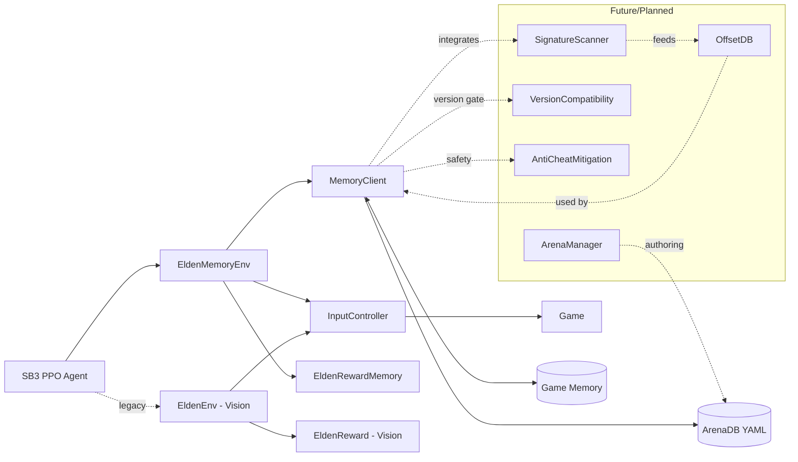

# EldenRL (Hybrid) – Memory-based arenas with optional vision

EldenRL now supports instant, memory-based resets for boss arenas while keeping the original vision-based observation loop available. You can train either:
- MEMORY mode: No screen capture. Observations come from game memory (hp, stamina, boss hp, etc.).
- VISION mode (legacy): Uses screenshots for observations, but resets are now instant and memory-based.

The training stack remains built on OpenAI `gym` and Stable-Baselines3.

## Requirements
- Windows 11 recommended
- Elden Ring (single-player offline; fixed game version while reversing addresses)
- Python 3.9.13
- Stable-Baselines3, PyTorch
- MEMORY mode: PyYAML (and your chosen memory read/write backend when you implement it)
- VISION mode: OpenCV, `mss`, Tesseract OCR

## Quick start
1) Install dependencies (venv recommended)
2) Choose mode in `main.py` via `ENV_MODE`: `"MEMORY"` or `"VISION"`
3) For MEMORY mode:
   - Copy `config/memory_arenas.sample.yaml` to `config/memory_arenas.yaml`
   - Fill in addresses/coords for your target boss
   - Set `MEMORY_CONFIG_PATH` in `main.py`
4) Run `python main.py`

## Configuration
`main.py` exposes the runtime config. Key fields:
- `ENV_MODE`: `VISION` or `MEMORY`
- `RESET_MODE`: In VISION env, set to `MEMORY` to enable instant resets (default)
- `PROCESS_NAME`: game process (default: `eldenring.exe`)
- `MEMORY_CONFIG_PATH`: YAML with per-boss arenas
- `BOSS`, `BOSS_HAS_SECOND_PHASE`, `DESIRED_FPS` etc.

YAML schema (example):
```yaml
version: 1
process_name: eldenring.exe
arenas:
  - id: 8
    name: Malenia, Blade of Miquella
    map: Haligtree
    player_spawn: { x: 0.0, y: 0.0, z: 0.0, rot: 0.0 }
    camera: { yaw: 0.0, pitch: 0.0 }
    player: { hp_addr: 0xDEADBEEF, stam_addr: 0xDEADBEEF, pos_addr: 0xDEADBEEF }
    boss: { hp_addr: 0xDEADBEEF, state_addr: 0xDEADBEEF, ai_state_addr: 0xDEADBEEF }
    flags: { in_combat_addr: 0xDEADBEEF, loading_addr: 0xDEADBEEF }
    second_phase: { trigger_flag_addr: 0xDEADBEEF }
    notes: "Replace placeholders with valid addresses for your version"
```

## Architecture


## Modes
- MEMORY mode:
  - Env: `EldenMemoryEnv`
  - Observation: numeric state vector (hp, stamina, boss hp, time alive, arena phase)
  - Reset: instant via `MemoryClient.reset_arena`
- VISION mode (legacy):
  - Env: `EldenEnv`
  - Observation: image + hp/stamina from vision
  - Reset: instant via `MemoryClient.reset_arena` (hybrid). No `walkToBoss.py` usage.

## Notes on safety and scope
- Educational research only; single-player offline.
- Addresses are version-specific; store them in YAML per boss.
- Start with one arena and iterate.

## Contributing
- Add new arenas by extending the YAML and implementing the corresponding reads/writes in `MemoryClient`.
- Future contributions: signature scanning, offset DB, anti-cheat mitigation, version checks.

## Credits
This project builds on the original EldenRL and community work. The vision pipeline remains available as a legacy option, while new development focuses on memory-based arenas.
