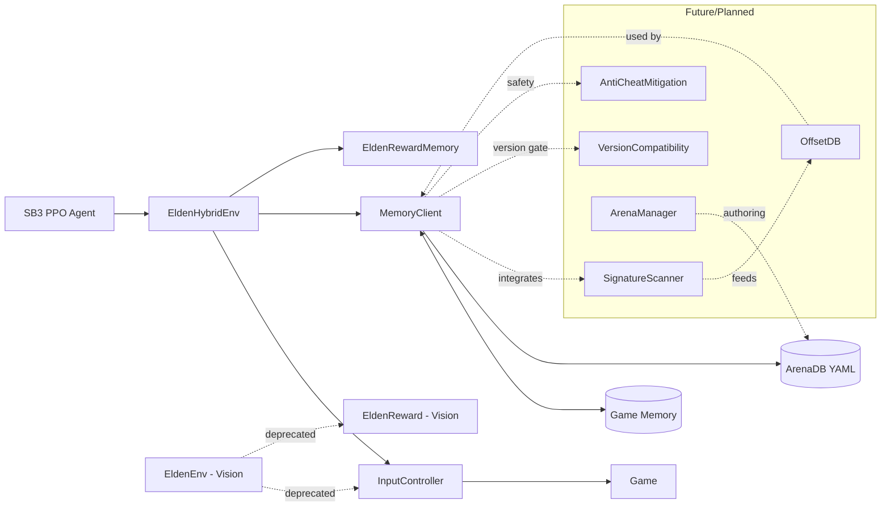

# EldenRL (Hybrid) – Single pipeline using vision + memory

EldenRL now uses one unified environment that combines a real game image (for spatial context) with precise state read from game memory (hp, stamina, boss hp, etc.). Rewards and termination come from memory; the image is for perception of obstacles and motion.

The training stack remains based on OpenAI `gym` (Gymnasium) and Stable-Baselines3.

## Requirements

- Windows 10/11
- Elden Ring running in single-player offline mode (fixed version while using memory addresses)
- Python 3.9.13
- Stable-Baselines3, PyTorch
- OpenCV, `mss`, Tesseract OCR (for image capture)
  
Note: This project is standalone. Other projects like “SoulsGym” are reference-only (useful for ideas).

## Quick start

1. Install dependencies (venv recommended)
2. Configure `main.py` (Hybrid is default)
3. Run `python main.py`

## Configuration

`main.py` exposes the runtime config. Key fields:

- `PROCESS_NAME`: game process (default: `eldenring.exe`)
- `MEMORY_CONFIG_PATH`: optional YAML with per-boss arenas (spawn positions; used during reset)
- `SIMULATE_MEMORY`: True to use offline simulated memory values for local dry-runs (no game required)
- `MONITOR`, `PYTESSERACT_PATH`, `DEBUG_MODE`: for image capture/display
- `BOSS`, `BOSS_HAS_SECOND_PHASE`, `DESIRED_FPS` etc.

YAML schema (example):

```yaml
version: 1
process_name: eldenring.exe
arenas:
  - id: 8
    name: Malenia, Blade of Miquella
    map: Haligtree
    player_spawn: { x: 0.0, y: 0.0, z: 0.0, rot: 0.0 }
    camera: { yaw: 0.0, pitch: 0.0 }
    player: { hp_addr: 0xDEADBEEF, stam_addr: 0xDEADBEEF, pos_addr: 0xDEADBEEF }
    boss:
      { hp_addr: 0xDEADBEEF, state_addr: 0xDEADBEEF, ai_state_addr: 0xDEADBEEF }
    flags: { in_combat_addr: 0xDEADBEEF, loading_addr: 0xDEADBEEF }
    second_phase: { trigger_flag_addr: 0xDEADBEEF }
    notes: "Replace placeholders with valid addresses for your version"
```

## Architecture



## Observation and rewards

- Observation (default):

  - `img`: `(MODEL_HEIGHT, MODEL_WIDTH, 3)` uint8
  - `prev_actions`: `(10, NUMBER_DISCRETE_ACTIONS, 1)` uint8
  - `state`: `(5,)` float32 = `[hp, stamina, boss_hp, time_alive_s, arena_phase]`

- Reward/termination: computed purely from memory values via `EldenRewardMemory`.

## Requirements for real memory backend

- Elden Ring process available and running offline
- Per-version addresses configured in YAML
- New game save recommended (stability/safety)

## Notes on safety and scope

- Educational research only; single-player offline.
- Addresses are version-specific; keep your game version fixed while reversing.
- Start with one arena and iterate.

## Extending state and future work

- Add more memory features: exact `player_pose`, `lock_on`, `in_combat`, FP/MP, debuffs, weapon data
- When boss entity offsets are known, implement boss HP read/write and better arena resets
- Optional signature scanning and version gating for robustness

## Contributing

- Add new arenas by extending the YAML and implementing the corresponding reads/writes in `MemoryClient`.
- Future contributions: signature scanning, offset DB, anti-cheat mitigation, version checks.

## Credits

This project builds on the original EldenRL and SoulsGym work. The legacy vision-only env remains for reference, but all training should use the hybrid environment.
