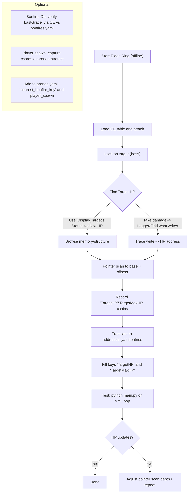

# Cheat Engine workflow: capturing Target HP and arena metadata

This guide shows a reliable way to extract the lock-on target (boss) HP pointers and wire them into the hybrid EldenRL pipeline.

## Prerequisites

- Elden Ring running offline
- Cheat Engine (CE) with your ER table loaded and attached
- Pointer scan capability enabled in CE

## Steps (diagram)



## Translating CE pointers to YAML

Once you have a stable pointer chain for the current lock-on target HP:

- Add entries to `config/addresses.yaml`:

```yaml
addresses:
  TargetHP: { base: LockTgtMan, offsets: [0x..., 0x..., ...], type: int }
  TargetMaxHP: { base: LockTgtMan, offsets: [0x..., 0x..., ...], type: int }
```

- If your pointer uses a different base, name it appropriately. If needed, add the AOB in `bases_by_pattern`.

## Arena metadata

- In `config/arenas.yaml`, for each boss:
  - `nearest_bonfire_key`: key from `config/bonfires.yaml`
  - `player_spawn`/`camera`: set coordinates and viewing direction for the arena entrance

## Testing

- Validate configs: `python tools/cli.py validate`
- Dry sim (no key presses): `python tools/cli.py sim_loop 200 --boss 8 --fps 24`
- Live run: `python main.py` (set `SIMULATE_MEMORY=False` and ensure SoulsGym is working)

## Notes

- Keep game offline
- Address chains are version-specific; keep a fixed ER version while training
- If boss HP doesn’t update, increase pointer scan depth or re-trace writes during damage
